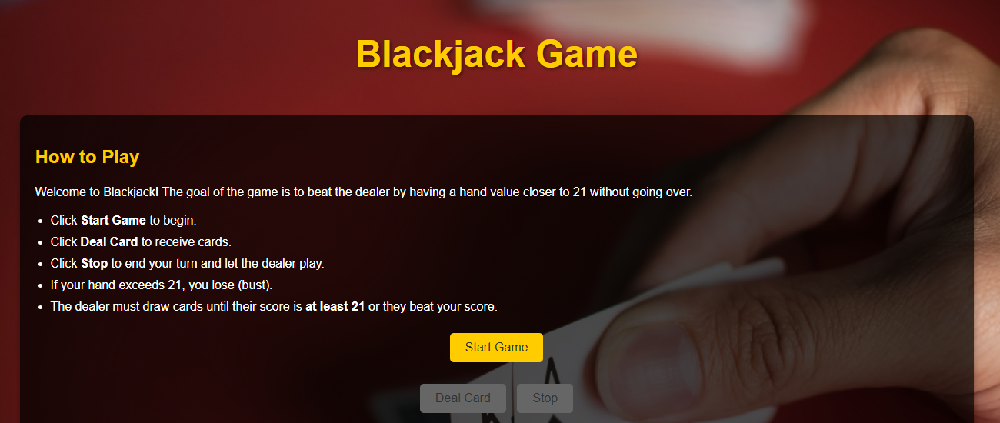

# Blackjack Game

 <!-- Add a screenshot of your game if available -->

Welcome to the **Blackjack Game**! This is a simple, interactive web-based Blackjack game built using HTML, CSS, and JavaScript. The game allows you to play against a computer dealer and test your luck and strategy.

---

## Table of Contents
- [How to Play](#how-to-play)
- [Features](#features)
- [Play the Game](#play-the-game)
- [Technologies Used](#technologies-used)
- [Contributing](#contributing)
- [License](#license)
- [Acknowledgements](#acknowledgements)

---

## How to Play

The goal of Blackjack is to beat the dealer by having a hand value closer to 21 without going over. Here's how to play:

1. **Start the Game**: Click the "Start Game" button to initialize the deck and shuffle the cards.
2. **Deal Cards**: Click the "Deal Card" button to receive cards. On the first click, you will receive two cards.
3. **Stop**: Click the "Stop" button to end your turn and let the dealer play.
4. **Winning**:
   - If your hand exceeds 21, you lose (bust).
   - The dealer must draw cards until their score is at least 21 or they beat your score.
   - The player with the highest score (without exceeding 21) wins.

---

## Features

- **Interactive Gameplay**: Play against a computer dealer in real-time.
- **Dynamic Card Display**: Cards are displayed with images for a realistic experience.
- **Score Tracking**: Real-time updates of player and dealer scores.
- **Responsive Design**: The game is optimized for both desktop and mobile devices.

---

## Play the Game

You can play the game online by clicking the link below:

[Play Blackjack Game](https://francismsangi.github.io/blackjack-game/blackJack.html)

---

## Technologies Used

- **HTML**: Structure of the game.
- **CSS**: Styling and layout.
- **JavaScript**: Game logic and interactivity.
- **GitHub Pages**: Hosting the game online.

---
